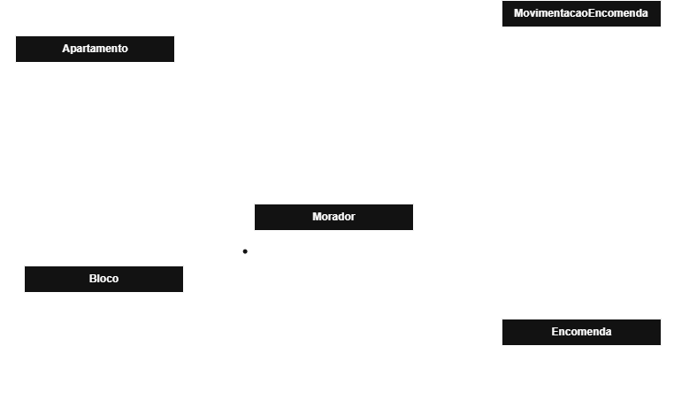

# 📦 Gerenciador de Encomendas

Sistema para gerenciamento de encomendas em condomínios residenciais, desenvolvido com Java e Spring Boot.

O objetivo deste projeto é aplicar boas práticas de desenvolvimento Back-end, arquitetura em camadas, modelagem de domínio e versionamento de banco de dados, evoluindo o sistema incrementalmente por meio de Sprints.

---

# 🎯 Objetivos

- Desenvolver uma API REST profissional utilizando Spring Boot.
- Aplicar boas práticas de arquitetura e organização por domínio.
- Versionar o banco de dados utilizando Flyway.
- Construir um projeto escalável e de fácil manutenção.
- Documentar as decisões técnicas tomadas durante o desenvolvimento.

---

# 🛠️ Tecnologias

- Java 25
- Spring Boot 4
- Spring Data JPA
- Hibernate
- PostgreSQL
- Flyway
- Maven
- Git
- GitHub

---

# 🏗️ Arquitetura

O projeto utiliza arquitetura em camadas, organizada por domínio.

```text
src/main/java/br/com/jjnervosia/gerenciador_encomendas

bloco/
├── dto/
│   └── CadastrarBlocoDTO.java
├── Bloco.java
├── BlocoController.java
├── BlocoRepository.java
└── BlocoService.java

apartamento/
morador/
encomenda/
historico/
```

Essa organização aproxima todos os arquivos relacionados ao mesmo domínio, facilitando a manutenção e evolução do sistema.
---

# 🗂️ Modelagem do Domínio (MVP)

Antes da implementação da API, foi realizada a modelagem inicial do domínio para definir as principais entidades e seus relacionamentos.

Essa modelagem representa a primeira versão (MVP) do sistema e servirá como base para a evolução das próximas funcionalidades.

<p>
  
</p>
---

# 📐 Princípios adotados

Durante o desenvolvimento, algumas decisões arquiteturais foram definidas desde o início:

- Organização por domínio.
- Responsabilidade única (Single Responsibility Principle).
- Regras de negócio centralizadas na camada Service.
- Persistência isolada na camada Repository.
- Entidades protegidas contra estados inválidos.
- Banco de dados tratado como código através do Flyway.
- Restrições críticas garantidas tanto na aplicação quanto no banco de dados.

---

# 🤝 Processo de Desenvolvimento

Este projeto é desenvolvido utilizando Inteligência Artificial como apoio técnico, simulando a dinâmica entre um Desenvolvedor Back-end e um Tech Lead.

O foco da utilização da IA não é a geração automática de código, mas sim o desenvolvimento do raciocínio técnico, por meio de discussões sobre arquitetura, modelagem, revisão de código e tomada de decisões.

Cada funcionalidade segue um fluxo semelhante ao encontrado em equipes de desenvolvimento:

1. Definição do problema.
2. Discussão da solução.
3. Implementação realizada por mim.
4. Code Review técnico.
5. Refatorações.
6. Registro das decisões arquiteturais.

---

# 📁 Banco de Dados

Tecnologia utilizada:

- PostgreSQL

Versionamento:

- Flyway

## Estrutura atual

### bloco

| Campo | Tipo | Restrições |
|--------|------|------------|
| id | BIGSERIAL | PRIMARY KEY |
| identificacao | VARCHAR(5) | NOT NULL, UNIQUE |

---

# 📌 Roadmap

## Sprint 1 — Fundação do Projeto ✅

- [x] Criação do projeto Spring Boot
- [x] Configuração do PostgreSQL
- [x] Configuração do Flyway
- [x] Primeira Migration
- [x] Modelagem inicial do banco
- [x] Entidade Bloco

---

## Sprint 2 — Camada de Negócio ✅

- [x] BlocoRepository
- [x] BlocoService
- [x] Primeira regra de negócio
- [x] Injeção de Dependência (Constructor Injection)
- [x] README inicial

---

## Sprint 3 — API REST ✅

- [x] BlocoController
- [x] DTO de cadastro
- [x] Bean Validation
- [x] Endpoint POST /blocos
- [x] Testes utilizando Postman
- [x] ResponseEntity (201 Created)

---
## Sprint 4 — Tratamento de Erros ✅

- [x] BlocoJaExisteException
- [x] GlobalExceptionHandler
- [x] ApiError
- [x] CampoErro
- [x] Tratamento HTTP 409
- [x] Tratamento HTTP 400
- [x] Testes no Postman

## Próximas Sprints

- [ ] Apartamentos
- [ ] Moradores
- [ ] Encomendas
- [ ] Histórico de Encomendas
- [ ] Swagger / OpenAPI
- [ ] Docker
- [ ] Autenticação
- [ ] Deploy

---

# 🚀 Roadmap Funcional

## Blocos

- [x] Cadastro
- [ ] Consulta por ID
- [ ] Listagem
- [ ] Atualização
- [ ] Exclusão

## Apartamentos

- [ ] Cadastro
- [ ] Consulta
- [ ] Atualização
- [ ] Exclusão

## Moradores

- [ ] Cadastro
- [ ] Consulta
- [ ] Atualização
- [ ] Exclusão

## Encomendas

- [ ] Cadastro
- [ ] Recebimento
- [ ] Retirada
- [ ] Histórico

## Funcionalidades Futuras

- [ ] QR Code para retirada
- [ ] Dashboard administrativo
- [ ] Múltiplos condomínios
- [ ] Docker
- [ ] Swagger
- [ ] Deploy
---

# 📚 Journal de Desenvolvimento

## Sprint 1

### Objetivos

Construção da fundação do projeto.

### Entregas

- Estrutura inicial.
- Configuração do PostgreSQL.
- Configuração do Flyway.
- Primeira entidade (Bloco).
- Primeira Migration.

### Principais aprendizados

- Papel do JPA.
- Papel do Hibernate.
- Papel do Spring Data JPA.
- Organização por domínio.
- Banco versionado utilizando Flyway.

---

## Sprint 2

### Objetivos

Implementar a primeira camada de regras de negócio.

### Entregas

- Criação do BlocoRepository.
- Criação da BlocoService.
- Primeira validação de domínio.
- Validação de duplicidade utilizando Spring Data JPA.
- Introdução à Injeção de Dependência.

### Principais aprendizados

- Constructor Injection.
- Responsabilidade única.
- Repository Pattern.
- Diferença entre domínio e persistência.
- Quando validar na aplicação e quando validar no banco.

---

## Sprint 3

### Objetivos

Disponibilizar o primeiro endpoint REST da aplicação.

### Entregas

- Criação da BlocoController.
- Implementação do DTO de cadastro.
- Bean Validation.
- Endpoint POST /blocos.
- ResponseEntity com HTTP 201.
- Testes utilizando Postman.

### Principais aprendizados

- Fluxo de uma requisição HTTP no Spring Boot.
- DispatcherServlet. (Responsável por entender o que vem do cliente e passar para o controller)
- DTOs utilizando record.
- Bean Validation.
- ResponseEntity.
- Diferença entre 200 OK e 201 Created.

---
## Sprint 4

### Objetivos

Padronizar o tratamento de erros da API e fornecer respostas consistentes para regras de negócio e validações.

### Entregas

- Criação da BlocoJaExisteException.
- Criação da GlobalExceptionHandler.
- Padronização das respostas de erro utilizando ApiError.
- Implementação do CampoErro para detalhamento das validações.
- Tratamento das exceções de domínio (HTTP 409 Conflict).
- Tratamento do Bean Validation (HTTP 400 Bad Request).
- Testes realizados via Postman.

### Principais aprendizados

- Diferença entre exceções de domínio e exceções de infraestrutura.
- Criação de exceções customizadas.
- Funcionamento do @RestControllerAdvice.
- Uso do @ExceptionHandler.
- Construção de respostas HTTP padronizadas.
- Bean Validation e MethodArgumentNotValidException.
- Collections (List e ArrayList).
- Enhanced for (for-each).
- Programar para interfaces, não para implementações.

# 👨‍💻 Autor

**Jackson Medeiros**

Projeto desenvolvido com foco na construção de software utilizando boas práticas de arquitetura, versionamento de banco de dados e organização por domínio.

A Inteligência Artificial foi utilizada como apoio técnico durante o desenvolvimento, atuando como um Tech Lead em discussões de arquitetura, revisão de código e evolução das soluções, enquanto toda a implementação foi construída a partir do entendimento dos conceitos estudados.